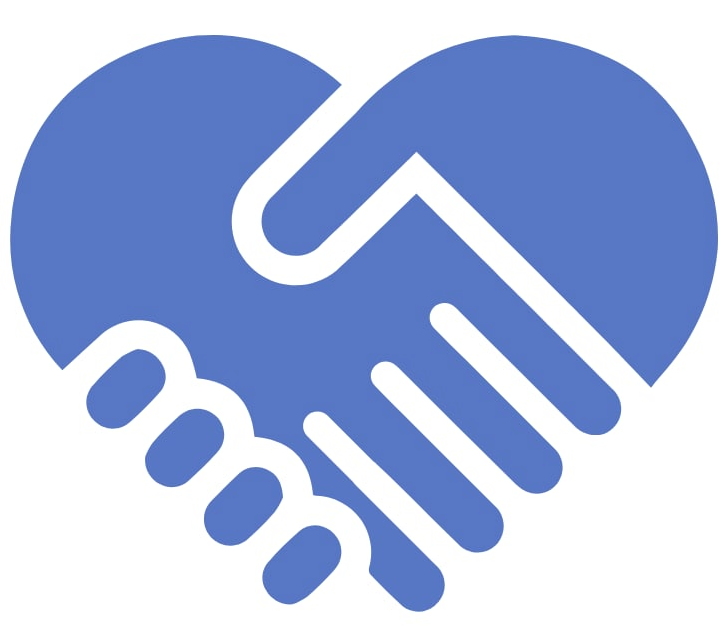

<!-- Improved compatibility of back to top link: See: https://github.com/othneildrew/Best-README-Template/pull/73 -->
<a name="readme-top"></a>
<!--
*** Thanks for checking out the Best-README-Template. If you have a suggestion
*** that would make this better, please fork the repo and create a pull request
*** or simply open an issue with the tag "enhancement".
*** Don't forget to give the project a star!
*** Thanks again! Now go create something AMAZING! :D
-->


<!-- PROJECT SHIELDS -->
<!--
*** I'm using markdown "reference style" links for readability.
*** Reference links are enclosed in brackets [ ] instead of parentheses ( ).
*** See the bottom of this document for the declaration of the reference variables
*** for contributors-url, forks-url, etc. This is an optional, concise syntax you may use.
*** https://www.markdownguide.org/basic-syntax/#reference-style-links
-->
[![Contributors][contributors-shield]][contributors-url]
[![Forks][forks-shield]][forks-url]
[![Stargazers][stars-shield]][stars-url]
[![Issues][issues-shield]][issues-url]
[![MIT License][license-shield]][license-url]


<!-- PROJECT LOGO -->
<br />
<div align="center">
  <a href="https://github.com/kappassov/helptalk-backend">
    
  </a>

<h3 align="center">HelpTalk</h3>

  <p align="center">
    Senior project in terms of BSc in Computer Science program
    <br />
    <a href="https://helptalk.org">View Demo</a>
    ·
    <a href="https://github.com/Makhayev/helptalk-frontend">Frontend Repository</a>
    ·
    <a href="https://github.com/kappassov/helptalk-backend/issues">Report Bug</a>
    ·
    <a href="https://github.com/kappassov/helptalk-backend/issues">Request Feature</a>
  </p>
</div>


<!-- TABLE OF CONTENTS -->
<details>
  <summary>Table of Contents</summary>
  <ol>
    <li>
      <a href="#about-the-project">About The Project</a>
      <ul>
        <li><a href="#built-with">Built With</a></li>
      </ul>
    </li>
    <li>
      <a href="#getting-started">Getting Started</a>
      <ul>
        <li><a href="#prerequisites">Prerequisites</a></li>
        <li><a href="#installation">Installation</a></li>
      </ul>
    </li>
    <li><a href="#usage">Usage</a></li>
    <li><a href="#roadmap">Roadmap</a></li>
    <li><a href="#contributing">Contributing</a></li>
    <li><a href="#license">License</a></li>
    <li><a href="#contact">Contact</a></li>
    <li><a href="#acknowledgments">Acknowledgments</a></li>
  </ol>
</details>


<!-- ABOUT THE PROJECT -->
## About The Project

[![Product Name Screen Shot][product-screenshot]](https://example.com)

This project aims to create a platform that utilizes GPT-3 natural language processing technology to match users with the most suitable psychologist for their mental health needs. Users can describe their current mental situation, and the platform will analyze the text to identify patterns and keywords that can help match them with an appropriate psychologist. Once matched, users can schedule sessions and receive professional help. By using GPT-3 to match users with the right psychologist, the platform aims to make finding psychological help accessible, easy, and efficient for those who need it, ultimately improving their mental health and well-being.
<p align="right">(<a href="#readme-top">back to top</a>)</p>


### Built With

* [![Node][Node]][Node-url]
* [![TypeScript][Typescript]][Typescript-url]
* 
*	
* 
* 
* 
* 


<p align="right">(<a href="#readme-top">back to top</a>)</p>


<!-- GETTING STARTED -->
## Getting Started

This is an example of how you may give instructions on setting up your project locally.
To get a local copy up and running follow these simple example steps.

### Prerequisites

This is an example of how to list things you need to use the software and how to install them.
* npm
  ```sh
  npm install npm@latest -g
  ```

### Installation

1. Clone the repo
   ```sh
   git clone https://github.com/kappassov/helptalk-backend.git
   ```
2. Install NPM packages
   ```sh
   npm install
   ```
3. Set up your environmental variables

### Starting

1. 
   ```sh
   npm run dev
   ```
<p align="right">(<a href="#readme-top">back to top</a>)</p>

<!-- CONTRIBUTING -->
## Contributing

Contributions are what make the open source community such an amazing place to learn, inspire, and create. Any contributions you make are **greatly appreciated**.

If you have a suggestion that would make this better, please fork the repo and create a pull request. You can also simply open an issue with the tag "enhancement".
Don't forget to give the project a star! Thanks again!

1. Fork the Project
2. Create your Feature Branch (`git checkout -b feature/AmazingFeature`)
3. Commit your Changes (`git commit -m 'Add some AmazingFeature'`)
4. Push to the Branch (`git push origin feature/AmazingFeature`)
5. Open a Pull Request

<p align="right">(<a href="#readme-top">back to top</a>)</p>

<!-- ACKNOWLEDGMENTS -->
## Acknowledgments

* [OpenAI API](https://openai.com/blog/openai-api)

<p align="right">(<a href="#readme-top">back to top</a>)</p>


<!-- MARKDOWN LINKS & IMAGES -->
<!-- https://www.markdownguide.org/basic-syntax/#reference-style-links -->
[contributors-shield]: https://img.shields.io/github/contributors/kappassov/helptalk-backend.svg?style=for-the-badge
[contributors-url]: https://github.com/kappassov/helptalk-backend/graphs/contributors
[forks-shield]: https://img.shields.io/github/forks/kappassov/helptalk-backend.svg?style=for-the-badge
[forks-url]: https://github.com/kappassov/helptalk-backend/network/members
[stars-shield]: https://img.shields.io/github/stars/kappassov/helptalk-backend.svg?style=for-the-badge
[stars-url]: https://github.com/kappassov/helptalk-backend/stargazers
[issues-shield]: https://img.shields.io/github/issues/kappassov/helptalk-backend.svg?style=for-the-badge
[issues-url]: https://github.com/kappassov/helptalk-backend/issues
[license-shield]: https://img.shields.io/github/license/kappassov/helptalk-backend.svg?style=for-the-badge
[license-url]: https://github.com/kappassov/helptalk-backend/blob/master/LICENSE.txt
[product-screenshot]: misc/images/helptalk-main.png
[Node]: https://img.shields.io/badge/node.js-6DA55F?style=for-the-badge&logo=node.js&logoColor=white
[Node-url]: https://nodejs.org/
[Typescript]: https://img.shields.io/badge/typescript-%23007ACC.svg?style=for-the-badge&logo=typescript&logoColor=61DAFB
[Typescript-url]: https://www.typescriptlang.org/
